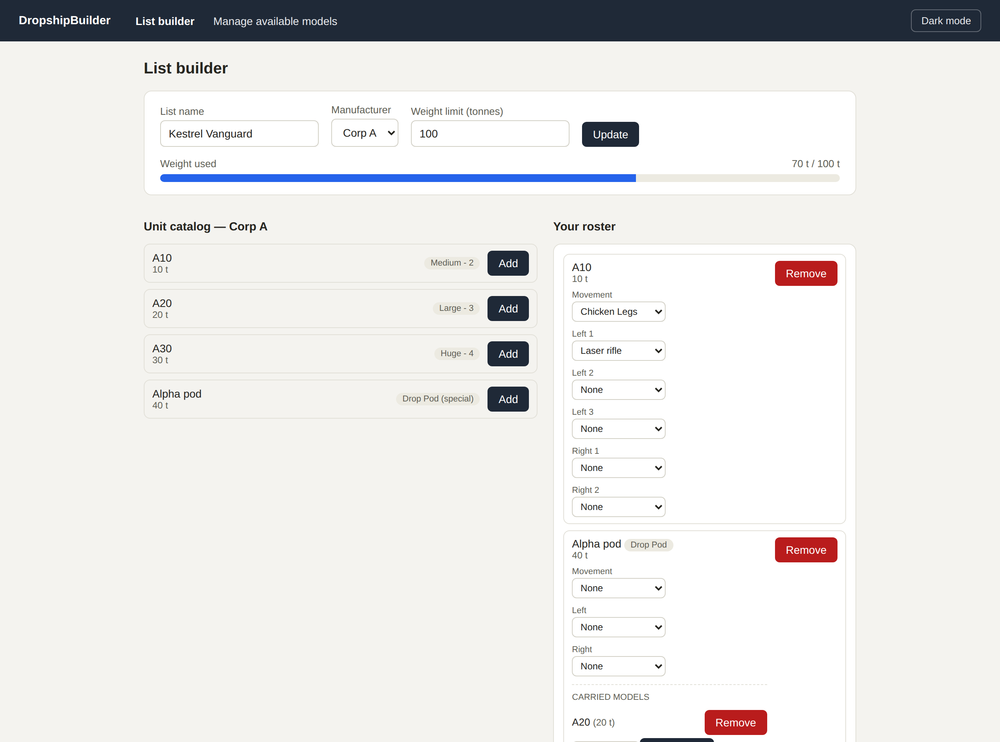
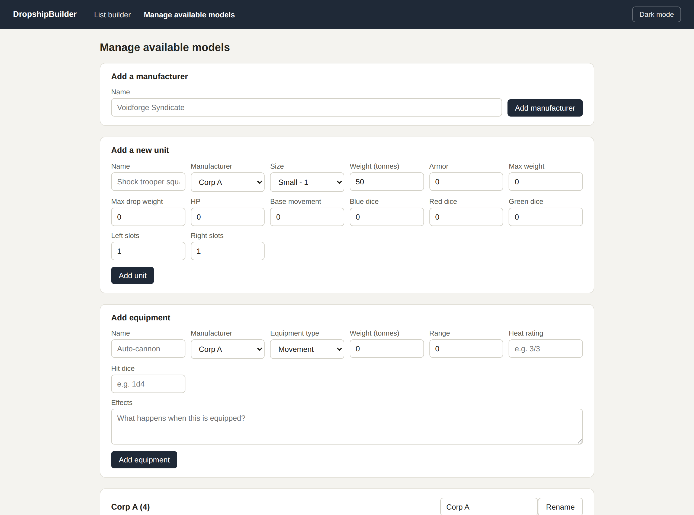

# DropshipBuilder

A list-building web app for Dropship, a tabletop wargame.

## Live Demo

🌐 https://Krayt1x.github.io/DropshipBuilder

## Screenshots

**List builder** — browse a manufacturer's catalog, add units to your roster, assign equipment to
each unit's movement/left/right slots, and track your list's total weight against its limit.



**Manage available models** — add manufacturers, units, and equipment to the catalog, or edit and
remove existing ones.



## Self-Hosting

```bash
git clone https://github.com/Krayt1x/DropshipBuilder.git
cd DropshipBuilder
cp .env.example .env
# Edit .env with your settings
docker compose -f docker-compose.prod.yml up -d
```

Open http://localhost:3000

## Features

- Build and save army lists for Dropship
- Faction and unit browser
- Point cost tracking

## Documentation

👉 **[Setup Guide →](https://github.com/Krayt1x/DropshipBuilder/wiki/Installation-Setup)**

## Contributing

- 📖 [Contribution Guide](./CONTRIBUTING.md)

## Development

### Stack

React + Vite (client), Express + Prisma (server), Postgres (database).

### Getting Started

```bash
npm install
cp .env.example .env
npm run dev
```

### Project Structure

- `packages/client/` — React SPA (also deployed standalone as the GitHub Pages demo)
- `packages/server/` — Express API + Prisma schema
- `docker/` — Dockerfile and backup entrypoint for self-hosting

### Testing

```bash
npm run test
```

### Building

```bash
npm run build
```

---

Built with React, Vite, Express, and Postgres. Licensed under MIT.
